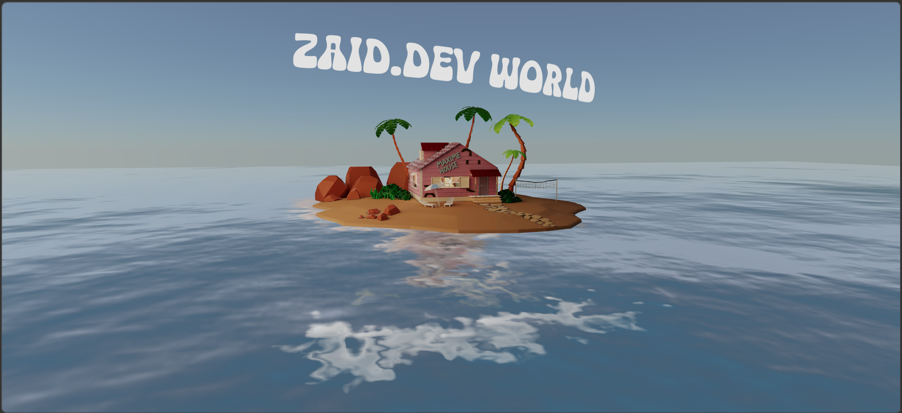

# Zaid.Dev World - Kame House Portfolio 🏠

A stunning, interactive 3D portfolio inspired by the legendary **Kame House** from Dragon Ball. Built with cutting-edge web technologies to deliver an immersive scrolling experience.



## ✨ Features
- **3D World**: Fully immersive 3D environment using Three.js and React Three Fiber.
- **Interactive Scrolling**: Dynamic camera movements and animations tied to user scroll.
- **Water Shaders**: Real-time ocean simulation with reflections.
- **Custom Fonts**: Stylized typography integrating into the 3D space.
- **Modern Tech Stack**: Leveraging Vite for lighting-fast development and React for a robust UI.

## 🛠️ Built With
- [React](https://reactjs.org/)
- [Three.js](https://threejs.org/) (via [@react-three/fiber](https://docs.pmnd.rs/react-three-fiber/getting-started/introduction))
- [@react-three/drei](https://github.com/pmndrs/drei)
- [GSAP](https://greensock.com/gsap/) (for smooth animations)
- [Vite](https://vitejs.dev/)
- [Tailwind CSS](https://tailwindcss.com/)

## 🚀 Getting Started

1. **Clone the repository:**
   ```bash
   git clone <your-repo-url>
   ```
2. **Install dependencies:**
   ```bash
   npm install
   ```
3. **Run the development server:**
   ```bash
   npm run dev
   ```

## 📂 Project Structure
- `src/App.jsx`: Main entry point for the 3D scene.
- `src/Components/House/`: 3D components of the Kame House.
- `src/Components/Ocean.jsx`: Custom ocean shader and water mesh.
- `src/Components/CameraScroll.jsx`: Camera pathing logic for the portfolio.

## 🎨 Asset Credits
- **Model**: Custom Kame House model (`House.glb`).
- **Typography**: Custom fonts located in `public/fonts/`.

## 👨‍💻 Author
**Zaid**

---
*Inspired by the Dragon Ball universe.*
